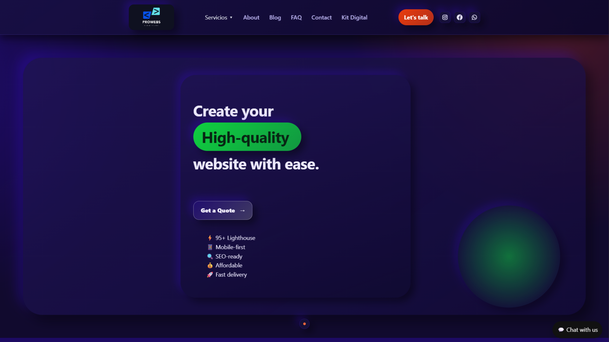
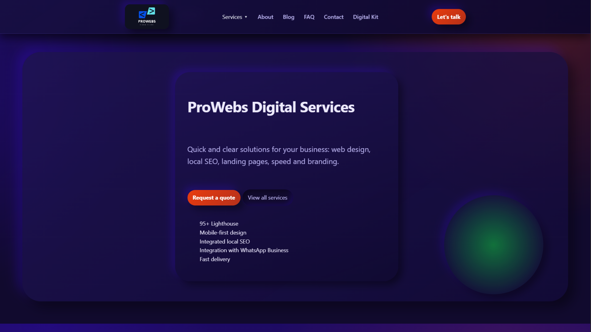
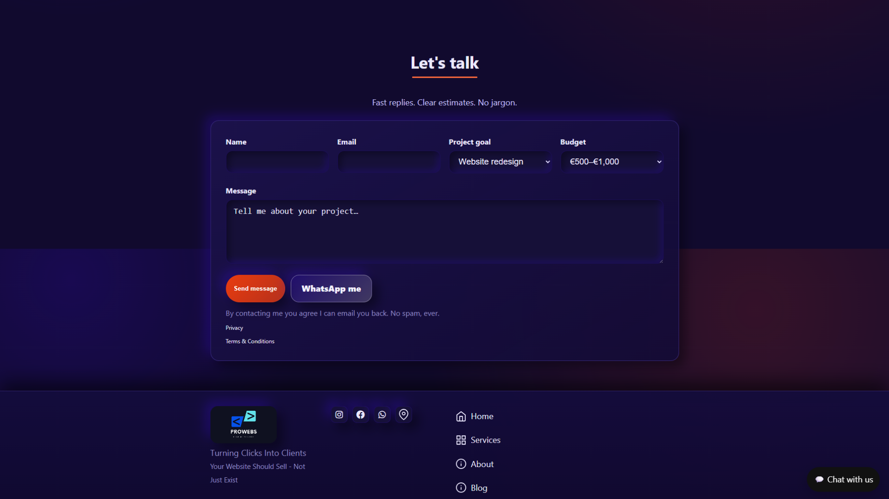
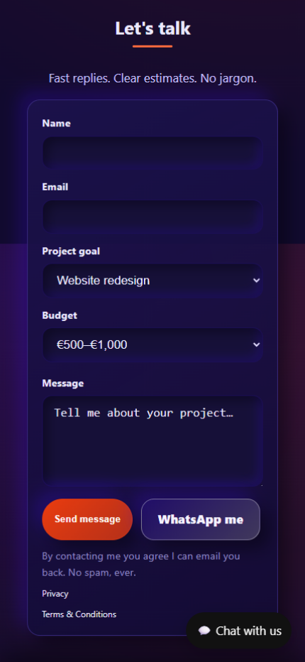

ProWebs Digital – Modern Web Design Agency Website

A clean, fast and modern agency site built to showcase high-performance front-end work, Scandinavian-inspired UI, glass-morphism aesthetics, and real-world business-focused web design.
Built with HTML, CSS, JavaScript and fully optimized for mobile performance.

🚀 Live Demo

🔗 https://prowebsdigital.com

✨ Features

Fully responsive layout

Modern glass-morphism components

Scandinavian minimal UI

Smooth CSS animations & micro-interactions

Fast loading (optimized images, compressed assets)

SEO-friendly structure

Mobile-first design

Clear CTAs (WhatsApp, contact)

Clean folder structure

No frameworks: pure HTML/CSS/JS

🛠 Tech Stack

HTML5

CSS3 (Flexbox, Grid)

JavaScript (DOM interactions)

Canva / Affinity Designer (brand assets)

VS Code

📁 Project Structure
/
├── index.html
├── assets/
│   ├── css/
│   ├── js/
│   ├── img/
│   └── fonts/
├── docs/
│   └── screenshots/
└── README.md

📸 Screenshots

###Home hero

###Services section

###Contact

###Mobile layout

📞 Contact

Website: https://prowebsdigital.com

WhatsApp: +34 643965138

Instagram: https://instagram.com/prowebsdigitalservices

Email: info@prowebsdigital.com

📌 Status

✔ Live
✔ Actively maintained
⬜ Expand portfolio section
⬜ Add blog/articles section
